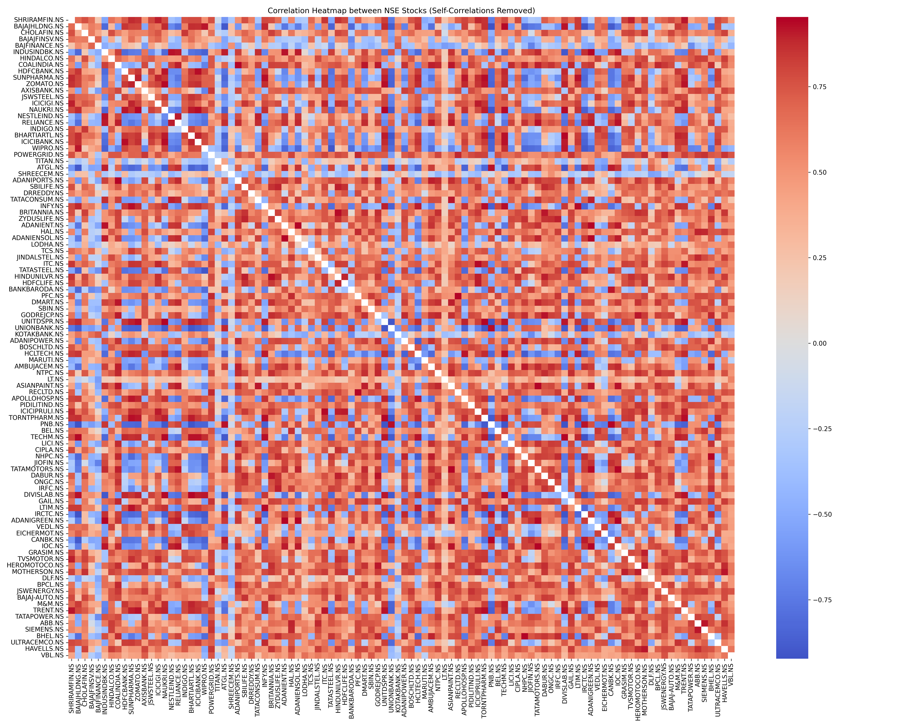

# Stock Market Lagged Correlation Analysis 📈

> A comprehensive analysis tool for studying lagged correlations between NSE stocks, with sector-based insights and visualization capabilities.

## 🎯 Objectives

- Calculate and analyze lagged correlations between stock pairs
- Identify lead-lag relationships in stock price movements
- Generate sector-wise correlation analysis
- Provide visual insights through heatmaps and correlation matrices

## 📊 Features

- **Lagged Correlation Analysis**
  - Customizable lag window (default: 20 days)
  - Both positive and negative lag detection
  - Statistical significance testing

- **Sector-based Analysis**
  - Pre-defined sector categorization
  - Sector-specific correlation matrices
  - Inter-sector relationship analysis

- **Visualization**
  - Correlation heatmaps
  - Sector-wise visualization
  - Time-lag relationship plots

## 🚀 Getting Started

### Prerequisites

- Python 3.8 or higher
- pip package manager
- Git (for cloning the repository)

### Installation

1. **Clone the repository**
   ```bash
   git clone https://github.com/yourusername/StockMarketProject.git
   cd StockMarketProject
   ```

2. **Create a virtual environment**
   ```bash
   # Windows
   python -m venv venv
   venv\Scripts\activate

   # Linux/Mac
   python3 -m venv venv
   source venv/bin/activate
   ```

3. **Install required packages**
   ```bash
   pip install -r requirements.txt
   ```

### Usage

1. **Prepare your data**
   - Place your stock data CSV in the `inputs` folder
   - Ensure CSV format matches required structure:
     ```
     Date,Stock1.NS,Stock2.NS,...
     YYYY-MM-DD,price1,price2,...
     ```

2. **Run the analysis**
   ```bash
   python codes/main.py
   ```

3. **Check outputs**
   - Results will be saved in the `outputs` folder
   - Sector-based results in `outputs/sector_based`

## 📁 Project Structure

```
/
├── inputs/
│   └── stocks.csv
├── outputs/
│   ├── max_lag_based/
│   │   ├── max_lag_20/
│   │   │   ├── categorized_correlations.csv
│   │   │   ├── correlation_heatmap.png
│   │   │   ├── stock_correlation_matrix.csv
│   │   │   └── top_correlations.csv
│   │   ├── max_lag_60/
│   │   │   ├── categorized_correlations.csv
│   │   │   ├── correlation_heatmap.png
│   │   │   ├── stock_correlation_matrix.csv
│   │   │   └── top_correlations.csv
│   │   └── max_lag_120/
│   │       ├── categorized_correlations.csv
│   │       ├── correlation_heatmap.png
│   │       ├── stock_correlation_matrix.csv
│   │       └── top_correlations.csv
│   └── sector_based/
│       ├── Automobiles_lagged_correlation.csv
│       ├── Automobiles_lagged_correlation_heatmap.png
│       ├── Consumer_Goods_lagged_correlation.csv
│       ├── Consumer_Goods_lagged_correlation_heatmap.png
│       ├── Energy_lagged_correlation.csv
│       ├── Energy_lagged_correlation_heatmap.png
│       ├── Financials_lagged_correlation.csv
│       ├── Financials_lagged_correlation_heatmap.png
│       ├── Infrastructure_lagged_correlation.csv
│       ├── Infrastructure_lagged_correlation_heatmap.png
│       ├── Metals_lagged_correlation.csv
│       ├── Metals_lagged_correlation_heatmap.png
│       ├── Miscellaneous_lagged_correlation.csv
│       ├── Miscellaneous_lagged_correlation_heatmap.png
│       ├── Pharmaceuticals_lagged_correlation.csv
│       ├── Pharmaceuticals_lagged_correlation_heatmap.png
│       ├── Technology_lagged_correlation.csv
│       ├── Technology_lagged_correlation_heatmap.png
│       ├── Telecommunications_lagged_correlation.csv
│       └── Telecommunications_lagged_correlation_heatmap.png
├── codes/
│   ├── trials/
│   │   ├── trial_0_nse_analysis.py
│   │   ├── trial_1_prototype.py
│   │   ├── trial_2_test_cases.py
│   │   ├── trial_3_basic_correlation.py
│   │   ├── trial_4_lag_analysis.py
│   │   ├── trial_5_visualization.py
│   │   ├── trial_6_categorized_correlation.py
│   │   ├── trial_7_enhanced_matrix.py
│   │   ├── trial_8_rolling_correlation.py
│   │   ├── trial_9_sector_correlation.py
│   │   ├── trial_10_lag_correlation.py
│   │   ├── trial_11_comprehensive_correlation.py
│   │   └── trial_12_combined_sector_analysis.py
│   └── main.py
├── requirements.txt
├── project_progress.md
├── report.md
└── README.md
```

## 📚 Documentation

- [**Project Progress**](project_progress.md) - Detailed evolution of trials and implementation
- [**Technical Report**](report.md) - Complete technical documentation and analysis results

## 📝 Output Files

1. `stock_correlation_matrix.csv`: Complete correlation matrix
2. `categorized_correlations.csv`: Categorized correlation results
3. `correlation_heatmap.png`: Visual representation of correlations
4. `sector_based/*.csv`: Sector-wise correlation analyses
5. `sector_based/*.png`: Sector-specific heatmaps

## 🤝 Contributors

<table style="border-spacing: 15px; border-collapse: separate; ">
  <tr>
    <td align="center" style="border-radius: 16px; background-color: #2d2d2d; padding: 25px; box-shadow: 0 4px 8px rgba(0,0,0,0.5);">
      <div style="border-radius: 50%; overflow: hidden; width: 120px; height: 120px; margin: 0 auto; border: 3px solid #4a4a4a;">
        <a href="https://github.com/SaniyaSaji">
          
        </a>
      </div>
      <br />
      <div style="margin: 15px 0; color: #ffffff;">
        <strong>Saniya Saji</strong>
      </div>
      <div style="display: flex; justify-content: center; gap: 16px;">
        <a href="mailto:saniyasaji18@gmail.com" style="text-decoration: none; background-color: #363636; padding: 8px; border-radius: 8px;">
          
        </a>
        <a href="https://www.linkedin.com/in/saniya-saji" style="text-decoration: none; background-color: #363636; padding: 8px; border-radius: 8px;">
          
        </a>
      </div>
    </td>
    <td align="center" style="border-radius: 16px; background-color: #2d2d2d; padding: 25px; box-shadow: 0 4px 8px rgba(0,0,0,0.5);">
      <div style="border-radius: 50%; overflow: hidden; width: 120px; height: 120px; margin: 0 auto; border: 3px solid #4a4a4a;">
        <a href="https://github.com/Nibras-10">
          
        </a>
      </div>
      <br />
      <div style="margin: 15px 0; color: #ffffff;">
        <strong>Nibras Ul Haque O N</strong>
      </div>
      <div style="display: flex; justify-content: center; gap: 16px;">
        <a href="mailto:nibrasu30@gmail.com" style="text-decoration: none; background-color: #363636; padding: 8px; border-radius: 8px;">
          
        </a>
        <a href="https://www.linkedin.com/in/nibras-ul-haque-o-n-2792a5258" style="text-decoration: none; background-color: #363636; padding: 8px; border-radius: 8px;">
          
        </a>
      </div>
    </td>
    <td align="center" style="border-radius: 16px; background-color: #2d2d2d; padding: 25px; box-shadow: 0 4px 8px rgba(0,0,0,0.5);">
      <div style="border-radius: 50%; overflow: hidden; width: 120px; height: 120px; margin: 0 auto; border: 3px solid #4a4a4a;">
        <a href="https://github.com/milangmatt">
          
        </a>
      </div>
      <br />
      <div style="margin: 15px 0; color: #ffffff;">
        <strong>Milan George Mathew</strong>
      </div>
      <div style="display: flex; justify-content: center; gap: 16px;">
        <a href="mailto:milangeorgem@gmail.com" style="text-decoration: none; background-color: #363636; padding: 8px; border-radius: 8px;">
          
        </a>
        <a href="https://www.linkedin.com/in/milangmatt" style="text-decoration: none; background-color: #363636; padding: 8px; border-radius: 8px;">
          
        </a>
      </div>
    </td>
  </tr>
</table>


## 📊 Sample Results

<div align="center">
  
  <br>
  <em>Sample correlation heatmap between NSE stocks</em>
</div>

---

<div align="center">
  Made with ❤️ for Intellibits Labs
</div>